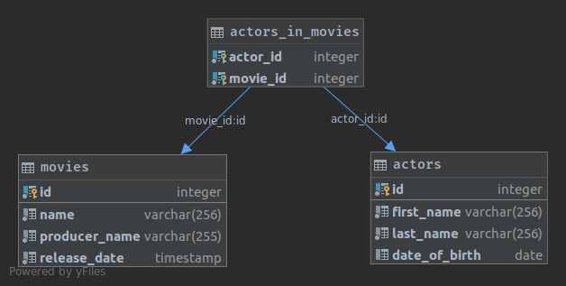

# Kotlin Exposed (SQL library) demo

This repository accompanies a blog post about 
[Kotlin Exposed (Kotlin SQL library)](https://github.com/JetBrains/Exposed).

The application stores Actors and Movies in an SQL database and exposes them via a 
simple REST api. The REST API is built with [Javalin](https://javalin.io/).

There are two variants, one with H2 and one with Postgres. H2 is the easiest starting point because it is an 
in-memory database.

### Running with H2

Run [MainWithH2.kt](src/main/kotlin/nl/toefel/blog/exposed/MainWithH2.kt). It will automatically:

 1. create an in-memory H2 database
 2. create the schema
 3. load test data
 4. start a API server at localhost:8080

### Running with Postgres

First start a Postgres database. If you have docker available, you can use:

    docker run --name exposed-db -p 5432:5432 -e POSTGRES_USER=exposed -e POSTGRES_PASSWORD=exposed -d postgres

Then run [MainWithPostgresAndHikari](src/main/kotlin/nl/toefel/blog/exposed/MainWithPostgresAndHikari.kt). It will:

 1. create a HikariCP datasource connecting to the postgres database
 2. create or update the schema
 3. load test data if not already present
 4. start a API server at localhost:8080

### Database diagram



# Overview of code

Start by looking at how the database tables are described [in code](src/main/kotlin/nl/toefel/blog/exposed/db/).
The database structure is specified in code very similar to SQL DDL statements. No annotations or reflection required.

 * [Actors.kt](src/main/kotlin/nl/toefel/blog/exposed/db/Actors.kt)
 * [Movies.kt](src/main/kotlin/nl/toefel/blog/exposed/db/Movies.kt)
 * [ActorsInMovies.kt](src/main/kotlin/nl/toefel/blog/exposed/db/ActorsInMovies.kt)

Notice that the database types `varchar`, `integer` and `date/datetime/timestamp` map to Kotlin types 
`String` and `Int` and `joda.DateTime`. Using these definitions, we can write queries in a type-safe manner using a DSL.

[Router.kt](src/main/kotlin/nl/toefel/blog/exposed/rest/Router.kt) contains the REST api which uses the DSL
to serve requests. The executed SQL queries are logging at runtime for debugging [logback.xml](src/main/resources/logback.xml).

To interact with the database, simply start a transaction block:

```kotlin
val actorCount = transaction {
    Actors.selectAll().count()
}
```

`transaction` uses the datasource that was configured in [MainWithH2.kt](src/main/kotlin/nl/toefel/blog/exposed/MainWithH2.kt)
or [MainWithPostgresAndHikari](src/main/kotlin/nl/toefel/blog/exposed/MainWithPostgresAndHikari.kt).
  
You can query as much as you want within a transaction block, when it goes out of scope without
an error, it will automatically `commit()`. Leaving the scope with an exception automatically 
triggers a `rollback()`. 

The last statement of the `transaction` is returned, as in the example. Transaction blocks can be nested, 
see [NestedTransactions](NestedTransactions.md) for details.

### Spring transaction management
Kotlin Exposed can use the spring transaction management. Import the [spring-transaction](https://mvnrepository.com/artifact/org.jetbrains.exposed/spring-transaction?repo=kotlin-exposed).
 dependency. 

```groovy
    implementation "org.jetbrains.exposed:spring-transaction:0.16.1"
```

Then create the `org.jetbrains.exposed.spring.SpringTransactionManager` bean in your application config: 
```kotlin
    @Bean
    fun transactionManager(dataSource: HikariDataSource): SpringTransactionManager {
        val transactionManager = SpringTransactionManager(
        dataSource, DEFAULT_ISOLATION_LEVEL, DEFAULT_REPETITION_ATTEMPTS)
        return transactionManager
    }
```

There is also an [exposed-spring-boot-starter](https://github.com/JetBrains/Exposed/tree/master/exposed-spring-boot-starter).

# Using the REST apis
When started, you can use these URL's to interact with it:

    # fetch all actors
    curl http://localhost:8080/actors | python -m json.tool
    
    # fetch all actors with first name Angelina
    curl http://localhost:8080/actors?firstName=Angelina
    
    # add an actor
    curl -X POST http://localhost:8080/actors -H 'application/json' \
       -d '{"firstName":"Ousmane","lastName":"Dembele","dateOfBirth":"1975-05-10"}' 
    
    # delete an actor
    curl -X DELETE http://localhost:8080/actors/2
    
    
    # fetch all movies
    curl http://localhost:8080/movies
    
    # fetch a specific movie to see which actors are in it
    curl http://localhost:8080/movies/2
    
## More info
 
 * [Exposed README](https://github.com/JetBrains/Exposed)
 * [Exposed wiki](https://github.com/JetBrains/Exposed/wiki) with the docs.
 * [Baeldung Guide to the Kotlin Exposed framework](https://www.baeldung.com/kotlin-exposed-persistence) older resource
 * [How we use Kotlin with Exposed for SQL access at TouK](https://medium.com/@pjagielski/how-we-use-kotlin-with-exposed-at-touk-eacaae4565b5)
 * [Bits and blobs of Kotlin/Exposed JDBC framework](https://medium.com/@OhadShai/bits-and-blobs-of-kotlin-exposed-jdbc-framework-f1ee56dc8840)